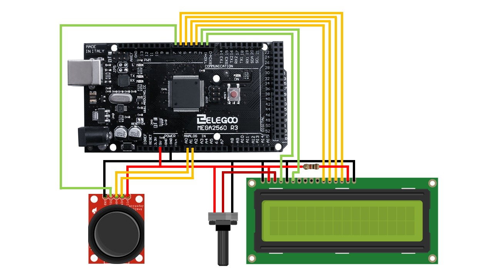

This project is a little video game I made while getting acquianted with joysticks and LCD displays for Arduino.

The goal of the game is to avoid the asteroids (**O**) using the joystick, which controls the player (**>**) movement and shoots lasers (**-**) if pressed. Should an asteroid get hit by a laser, it explodes. If the player gets hit by an asteroid, the game resets.

The following link will take you to a short video of the gameplay.

// insert video

## Wiring
Wiring the joystick was straightforward, but connecting the LCD display took longer than expected. Through trial an error, I identified a number of factors to consider when attaching an LCD display. First, you must have a 10k ohm potentiometer for controlling the contrast of the LCD screen. If you attempt to print characters without it, they will be completely invisible. Next, the LCD data lines must be plugged into D4-D7 inputs on the display, while the others remain open. Finally, to prevent internal damage, the second-to-right input on the LCD display requires a 220 ohm resistor.

Here are detailed instructions for [connecting the LCD](https://www.arduino.cc/en/Tutorial/HelloWorld) and [connecting the joystick](https://42bots.com/tutorials/arduino-joystick-module-example/). The following diagram shows how I connected all of the wires. The red, black, yellow, and green wires represent power, ground, data, and control lines, respectively.



## Coding
Before programming an Arduino board, one must first [set up the Arduino IDE](https://www.arduino.cc/en/Guide/ArduinoUno). 

This coding portion consists of four stages: setting up libraries and input/output pins, adding movement, adding boundaries, adding collisions. I will provide a surface level explanation for each of the stages and link the full source code down below.

### Setting Up Libraries and Pins
This project does not require any external libaries. The only built-in library that is needed is ***LiquidCrystal.h***, which provides necesary functionality for LCD displays that are compatible with the Hitachi HD44780 driver.

I following snippet of code outlines how I mapped my pin to the Arduino board.
```
#include <LiquidCrystal.h>

// map each pin to the respective inputs on the Arduino board
const int rs = 1, en = 2, d4 = 3, d5 = 4, d6 = 5, d7 = 6, sw = 7, xPin = A0, yPin = A1;

// initialize a 4-bit lcd display
LiquidCrystal lcd(rs, en, d4, d5, d6, d7);
```

### Adding Movement
The LiquidCrystal library allows you to print a character at a specific coordinate (column, row) on the display. To simulate movement, I update the position of each character and draw it.

Due to the nature of the LCD display, a character that is drawn will remain there until another one is drawn in its place. So, if I start at the top right corner of the display and move the player to the right, the end result will look something like this:
```
> > > > _ _
_ _ _ _ _ _
```
To avoid this problem, I draw an empty space at the character's last position. The end result becomes:
```
_ _ _ > _ _
_ _ _ _ _ _
```
The LCD display also has a ***clear()*** function that clears the entire screen, but it is rather costly for such a small project, especially if you are clearing the screen every 150 milliseconds.

### Adding Boundaries
Since characters cannot be printed outside of the **16 x 2** display, they need to be aware of the boundaries. I use different rules for different characters. The player stops moving if it has reached the edge of the screen, while the lasers and asteroids are simply removed from the game.

### Adding Collision
It wouldn't really be a game without collisions. The two collisions that need to be handled for this game are player-asteroid and laser-asteroid, both of which result in an explosion (**X**).

A collision occurs when two characters occupy the same position. There is one exception to that rule that occurs when two characters are moving towards each other. Consider the following scenario, where **>** is moving to the right and **O** is moving to the left:
```
_ > _ _ O _
_ _ _ _ _ _
```
In the next frame, the positions will be:
```
_ _ > O _ _
_ _ _ _ _ _
```
And finally:
```
_ _ O > _ _
_ _ _ _ _ _
```
As you can see, the characters never occupied the same position, skipping over each other instead. To handle this exception, one of the characters must check if it collided with the *previous* position of the other. That way, no collision will be unhandled.

## Conclusion
Although this was a fairly simple project, it definitely proved to be challenging at times. It gave me experience with wiring peripherals to the Arduino and error-handling circuits, which is not a trivial task in itself. I also learned how to properly convert analog input from the joystick into usable form and correctly print characters on the LCD display. All in all, I am satisfied with the result.

## Source Code
Here is a [link to the source code](https://github.com/Vladnet47/Vladnet47.github.io/blob/master/arduino_lcd_game/LCD_Game.ino).
